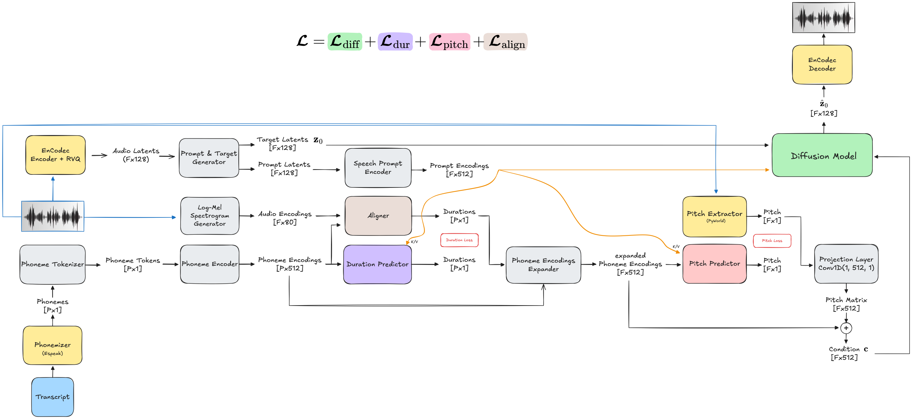
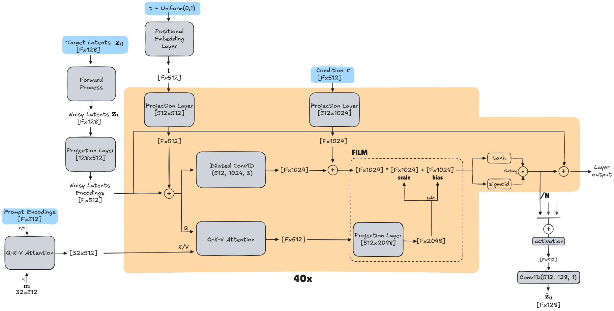
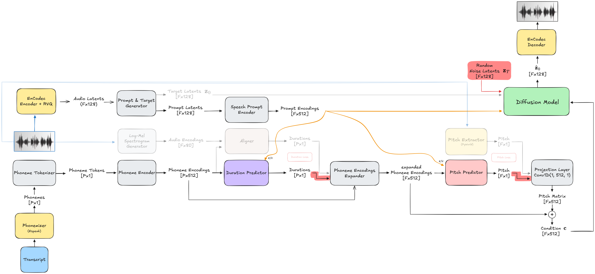

# NaturalSpeech 2 (Unofficial Implementation)

This repository contains an unofficial PyTorch implementation of the **NaturalSpeech 2** [1] text-to-speech (TTS) system.

### Model Architecture (Training)

Below is the complete forward pass through the NaturalSpeech 2 architecture during training. 
*(Click the image to expand and zoom in)*

[](assets/NS2_architecture.png)

*Color Coding:* The sub-modules with individual loss terms are colored the same as their respective terms at the top of the picture. Additionally, all yellow sub-modules represent pre-trained models that aren't trained together with the diffusion model.

**Modifications from the original paper:**
The original NaturalSpeech 2 [1] architecture utilized SoundStream, a proprietary phonemizer, and a proprietary aligner. To make this implementation fully open-source, we swapped SoundStream with Encodec [2], replaced the proprietary phonemizer with Espeak-ng, and used the TTS-Aligner [3] for the alignment mechanism.

At the core of the latent generation process lies the Diffusion Model, utilizing a dilated convolution and Q-K-V attention architecture:

[](assets/diffusion_model.png)

---

## Getting Started

This project is designed to run seamlessly inside a Docker container. We provide a `Dockerfile` and `docker-compose.yml` to handle all system dependencies, C++ extensions, and Python packages via Poetry.

### 1. Build and Start the Environment

Ensure you have Docker and the NVIDIA Container Toolkit installed. You'll also need to create a `docker-compose.override.yml` to pass machine-specific settings like your huggingface/hub cache and the shared memory size for PyTorch Dataloader workers.
Since the `entrypoint.sh` defaults to dropping you into a bash shell, you can build the image and start an interactive session immediately with:

```bash
docker compose run --rm --build ns2
```

*You are now inside the container's interactive shell*

### 2. Running the Training

We use Hydra for hierarchical configuration management. Configurations are defined in the `config/` directory, where `config/config.yaml` is the default configuration.

You can start the training process and dynamically override config values directly from the terminal. This includes individual values like the Learning Rate, but also full sets of configurations like setting up a specific dataset. 

For example:

```bash
python -m naturalspeech2.train dataset=vctk training.learning_rate=1e-4 wandb=serious_run
```

---

### 3. Custom Mounts and Large Datasets (MergerFS)

If your dataset spans multiple physical disks, the provided `entrypoint.sh` natively supports MergerFS to seamlessly pool them into the `/workspace/data` directory expected by the codebase.

You can configure this by adding the following lines to your `docker-compose.override.yml` file on your host machine to supply the `MERGERFS_DISKS` environment variable and mount the required drives:

```yaml
services:
  ns2:
    environment:
      - MERGERFS_DISKS=/disk1:/disk2
    volumes:
      # Host system disk mounts
      - /path/to/your/first/drive:/disk1
      - /path/to/your/second/drive:/disk2
    devices:
      # Required for mergerfs
      - /dev/fuse:/dev/fuse
    cap_add:
      - SYS_ADMIN
```

---

### 4. Benchmarking and Hardware Optimization

To maximize GPU VRAM utilization, enable efficient `torch.compile` graph caching, and mitigate memory fragmentation, this repository includes an automated benchmarking pipeline. 

We highly recommend running these steps before starting a full training run on a new dataset or hardware configuration.

**1. Dataloader Optimization**  
Determine the most efficient data loading strategy (resampling during pre-processing vs. on-the-fly) and test worker configurations.

```bash
naturalspeech2/benchmarks/dataloader/run_benchmark_dataloader.sh
```

**2. Finding Optimal Buckets**
Dynamic batch bucketing relies on grouping sequences by length. Fixed buckets are crucial for maximizing VRAM utilization, utilizing `torch.compile`, and reducing memory fragmentation. This script determines the optimal buckets for dynamic batch bucketing of a specific dataset.

```bash
python -m naturalspeech2.benchmarks.dataloader.find_optimal_buckets 
```

**3. Finding Maximum Batch Sizes**
Once your bucket boundaries are defined, you need to assign the respective buckets their optimal batch size, as the buckets only contain the optimal sequence length up until that point.

```bash
python -m naturalspeech2.benchmarks.dataloader.find_max_batch_sizes
```

**4. Stress Testing Memory Fragmentation**
Even though batch sizes might be stable individually, dynamically jumping between different shapes during training could trigger memory fragmentation. This stress test makes sure the batch sizes don't lead to an OOM deep into training when specific shapes/buckets follow each other.

```bash
python -m naturalspeech2.benchmarks.dataloader.stress_test_fragmentation
```

*If it passes, the output will yield a safe bucket mapping configuration that you can paste directly into your Hydra `config` setup.*

---

## Training Hardware

The reference models in this repository were trained on the following system configuration:

* **GPU:** NVIDIA RTX PRO 6000 Blackwell Workstation-Edition (96GB VRAM)
* **CPU:** 32 Cores
* **RAM:** 252GB 

---

## Inference and Pre-trained Models

> **Note:** This section is a placeholder. Pre-trained weights and generation scripts will be made available upon the completion of the training runs.

### Inference Architecture

During inference, the model takes a text transcript and a short speech prompt, predicting phoneme durations and pitch, and running the reverse diffusion process to synthesize the final audio latents.

[](assets/NS2_architecture_inference.png)

---

### Generating Audio

*(Instructions on downloading huggingface weights and running the `model.generate()` function will be added here)*

---

## References

*(For academic use, the BibTeX citations for these works can be found in [assets/references.bib](assets/references.bib))*

[1] Shen, K., Ju, Z., Tan, X., Liu, E., Leng, Y., He, L., Qin, T., Zhao, S., & Bian, J. (2024). NaturalSpeech 2: Latent Diffusion Models are Natural and Zero-Shot Speech and Singing Synthesizers. *International Conference on Representation Learning*.  
[2] Défossez, A., Copet, J., Synnaeve, G., & Adi, Y. (2023). High Fidelity Neural Audio Compression. *Transactions on Machine Learning Research*.  
[3] Badlani, R., Łańcucki, A., Shih, K. J., Valle, R., Ping, W., & Catanzaro, B. (2022). One TTS Alignment to Rule Them All. *ICASSP 2022 - 2022 IEEE International Conference on Acoustics, Speech and Signal Processing (ICASSP)*, 6092-6096.